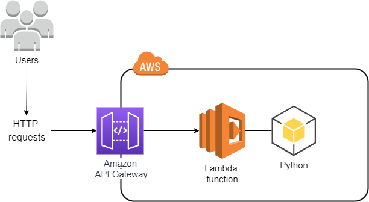

## Task 04 iam_task4_Lambda_With_APIGateway

##  diagram


### Task Resources
+ cmtr-2fa561ce-
+ region: eu-central-1
+ Lambda function ${lambda_function}: Returns a list of Lambda functions in the AWS account. This function has an execution role ${iam_role} and a resource-based policy and serves as the HTTP API back end.
+ Lambda execution role ${iam_role}.
+ API Gateway ${apigatewayv2_api}: An HTTP API integrated with the ${lambda_function} function.

### Objectives
You must achieve the following objectives in two moves:

Grant the correct permissions to the Lambda function so it can access the resources it needs based on the function code. Use the AWS managed policy that grants access to Lambda API actions, and follow the principle of least privilege. Please use the existing AWS policy; do not create your own.
Grant the correct permissions to the Lambda function so that the HTTP API can invoke it.
One move is to create, update, or delete an AWS resource. Some verification steps may pass without any action being applied, but to complete the task you must ensure that all the steps are passed.

### Steps 
```powershell
powershell
$Env:AWS_ACCESS_KEY_ID=AWS_ACCESS_KEY_ID
$Env:AWS_SECRET_ACCESS_KEY=AWS_SECRET_ACCESS_KEY
$Env:AWS_SESSION_TOKEN=AWS_SESSION_TOKEN
$env:AWS_DEFAULT_REGION = "eu-central-1"
```

### lambda 
```powershell
aws lambda list-functions --query "Functions[?starts_with(FunctionName, 'cmtr-2fa561ce')].{FunctionName: FunctionName, FunctionArn: FunctionArn}" --output table
```
arn:aws:lambda:eu-central-1:905418349556:function:cmtr-2fa561ce-iam-lp-lambda

```powershell
aws iam list-roles --query "Roles[?starts_with(RoleName, 'cmtr-2fa561ce')].Arn"
```
arn:aws:iam::905418349556:role/cmtr-2fa561ce-iam-lp-iam_role"


1. Grant the Lambda Execution Role Necessary Permissions : Enable Lambda Function Access to AWS Resources
```powershell
aws iam attach-role-policy --role-name cmtr-2fa561ce-iam-lp-iam_role --policy-arn arn:aws:iam::aws:policy/AWSLambda_ReadOnlyAccess
```
2 Enable Lambda Function Access to AWS Resources
```powershell
aws lambda add-permission --function-name cmtr-2fa561ce-iam-lp-lambda --statement-id AllowExecutionFromAPIGateway2 --action lambda:InvokeFunction --principal apigateway.amazonaws.com 
```

### verification
```powershell
aws iam list-attached-role-policies --role-name cmtr-2fa561ce-iam-lp-iam_role
aws lambda get-policy --function-name cmtr-2fa561ce-iam-lp-lambda
```