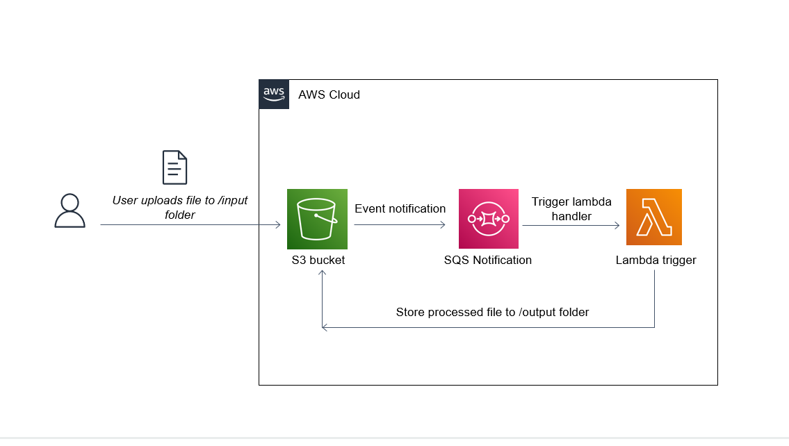

# task5_s3_sqs_lambda

##  diagram


## Description
The goal of this task is to set up an event-driven architecture using AWS S3, SQS, and Lambda services. When a file is added to a specific folder (input/) in an S3 bucket, a notification will be sent to an SQS queue, triggering a Lambda function. The Lambda function will process the file and store the result in the output directory of the S3 bucket.

Region-specific resources are created in the eu-central-1 region. For more details on regional services, see AWS Services by Region.

## Task Resources
+ S3 Bucket cmtr-2fa561ce-s3-snlt-bucket-438842: This bucket contains an /input folder where you will upload files.
+ SQS Queue cmtr-2fa561ce-s3-snlt-queue: This SQS queue needs to be configured as the notification destination for the S3 bucket and as the event source for the Lambda function.
+ Lambda Function cmtr-2fa561ce-s3-snlt-lambda: This Lambda function will poll for messages as they arrive in the SQS queue after S3 uploads, transform the files, and store the processed files in the /output directory of the S3 bucket.
All necessary permissions and policies have already been set.

## Objectives
In three moves, you must:

1. In the S3 bucket, create an event notification with the prefix /input for all object creation events, and set the cmtr-2fa561ce-s3-snlt-queue SQS queue as the destination to publish the events.
2. In the SQS queue, configure the Lambda function trigger to execute the function each time messages arrive in the queue. Wait for the trigger to be created.
3. Upload any .txt file into the /input folder of the S3 bucket.

4. One move is the creation, update, or deletion of an AWS resource. Some verification steps may pass without any action being applied, but to complete the task you must ensure that all the steps are passed.

## Steps

```powershell
$Env:AWS_ACCESS_KEY_ID=AWS_ACCESS_KEY_ID
$Env:AWS_SECRET_ACCESS_KEY=AWS_SECRET_ACCESS_KEY
$Env:AWS_SESSION_TOKEN=AWS_SESSION_TOKEN
$env:AWS_DEFAULT_REGION = "eu-central-1"
```
```powershell
aws s3api list-buckets --query "Buckets[].Name"  | Select-String "cmtr-2fa561ce"
```
	cmtr-2fa561ce-s3-snlt-bucket-438842

```powershell
aws lambda list-functions --query "Functions[?starts_with(FunctionName, 'cmtr-2fa561ce')].{FunctionName: FunctionName, FunctionArn: FunctionArn}" --output table
```
	arn:aws:lambda:eu-central-1:905418349556:function:cmtr-2fa561ce-s3-snlt-lambda
```powershell
aws sqs list-queues --output text | findstr /C:"cmtr-2fa561ce"
```
https://sqs.eu-central-1.amazonaws.com/905418349556/cmtr-2fa561ce-s3-snlt-queue
```powershell
aws sqs get-queue-attributes --queue-url "https://sqs.eu-central-1.amazonaws.com/905418349556/cmtr-2fa561ce-s3-snlt-queue" --attribute-names QueueArn
```
arn:aws:sqs:eu-central-1:905418349556:cmtr-2fa561ce-s3-snlt-queue
	
	
1. create  file task5_s3_sqs_notification.json
```powershell
aws s3api put-bucket-notification-configuration --bucket cmtr-2fa561ce-s3-snlt-bucket-438842 --notification-configuration file://./task5_s3_sqs_notification.json
aws s3api get-bucket-notification-configuration --bucket cmtr-2fa561ce-s3-snlt-bucket-438842
```
2. create SQS access policy create file task5_s3_sqs_access_policy.json

```powershell
aws sqs set-queue-attributes --queue-url https://sqs.eu-central-1.amazonaws.com/905418349556/cmtr-2fa561ce-s3-snlt-queue --attributes file://./task5_s3_sqs_access_policy.json
```

3. create Create an IAM Role for Lambda Execution task5_s3_sqs_notification_policy.json
```powershell
aws iam put-role-policy --role-name cmtr-2fa561ce-s3-snlt-iam_role  --policy-name s3_sqs_notification_policy --policy-document file://./task5_s3_sqs_notification_policy.json
```
	
4.  create trust relationship that allows the Lambda service to assume this role 	task5_lambda_assumerole.json
```powershell
aws iam update-assume-role-policy --role-name cmtr-2fa561ce-s3-snlt-iam_role --policy-document file://./task5_lambda_assumerole.json  
```

5, Link the SQS Queue to Your Lambda Function
```powershell
aws lambda create-event-source-mapping --function-name cmtr-2fa561ce-s3-snlt-lambda --batch-size 10 --event-source-arn arn:aws:sqs:eu-central-1:905418349556:cmtr-2fa561ce-s3-snlt-queue
```


### verification
copy file to s3
```powershell
aws s3 cp task5_s3_sqs_lambda.txt s3://cmtr-2fa561ce-s3-snlt-bucket-438842/input/task5_s3_sqs_lambda.txt

aws s3 ls s3://cmtr-2fa561ce-s3-snlt-bucket-438842/input/
aws s3 ls s3://cmtr-2fa561ce-s3-snlt-bucket-438842/output/
```
