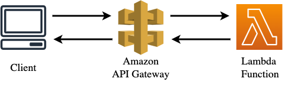

task6 Integration of API Gateway with a Lambda function

##  diagram

Task Resources
Region-specific resources are created in the ${aws_region} region. For more details on regional services, see AWS Services by Region.

The following infrastructure has been created for you:

API Gateway: ${api_gateway}
Route ID: ${route_id}
Lambda function: ${lambda_function_name}
Objectives
The Lambda function code has already been deployed. Your task is to:

Integrate the ${lambda_function_name} Lambda function with the ${api_gateway} API Gateway to handle requests from the existing ${route_id} route.
Integrate the ${lambda_function_name} Lambda function with the ${api_gateway} API Gateway to handle requests from the existing ${route_id} route.
Configure the ${lambda_function_name} function to return a list of contacts when invoked through GET /contacts:

cmtr-2fa561ce

aws lambda list-functions --query "Functions[?starts_with(FunctionName, 'cmtr-2fa561ce')].{FunctionName: FunctionName, FunctionArn: FunctionArn}" --output table
	arn:aws:lambda:eu-central-1:905418349556:function:cmtr-2fa561ce-api-gwlp-lambda-contacts

aws apigateway get-rest-apis | ConvertFrom-Json | ForEach-Object { $_.items } | Where-Object { $_.name -like "cmtr-2fa561ce*" }
aws apigatewayv2 get-apis | ConvertFrom-Json | ForEach-Object { $_.items } | Where-Object { $_.name -like "cmtr-2fa561ce*" }

cmtr-2fa561ce-api-gwlp-apigwv2_api

1 Configure Route
aws apigatewayv2 get-routes --api-id 7l595mx6cf
aws apigatewayv2 update-route --api-id 7l595mx6cf --route-id 1jdd4id --route-key "GET /contacts"

2 create file task6_api-gateway-lambda-permission.json

aws lambda add-permission --function-name cmtr-2fa561ce-api-gwlp-lambda-contacts --statement-id AllowExecutionFromAPIGateway  --action lambda:InvokeFunction --principal apigateway.amazonaws.com --source-arn "arn:aws:execute-api:eu-central-1:905418349556:*" --source-account 905418349556 --region eu-central-1

aws lambda get-policy --function-name cmtr-2fa561ce-api-gwlp-lambda-contacts --region eu-central-1

3 verification 
aws apigatewayv2 get-apis --query 'Items[?Name==`cmtr-2fa561ce-api-gwlp-apigwv2_api`]'
https://7l595mx6cf.execute-api.eu-central-1.amazonaws.com