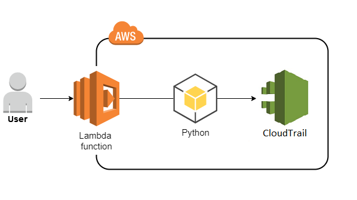

task08 Python Code for the Lambda Functiony

## Description
The goal of this task is to write a Python code for a Lambda function that retrieves a sorted list of all unique users for a specified time interval from the CloudTrail Event history

##  diagram



## Task Resources
+ region: eu-central-1 
+ prefix:  cmtr-2fa561ce
+ Lambda Function: cmtr-2fa561ce-lambda-fgufc-lambda

## Objectives
You must modify the `cmtr-2fa561ce-lambda-fgufc-lambda` function so that it returns a sorted list of all unique users for the specified time interval (start_time to end_time) from the CloudTrail Event history. The return value should be a list.

Tip: To get the list of unique users, you can first obtain the list of all users, convert it to a set to remove duplicates, and then convert it back to a list.

## Additional Resources
+ [update-function-code](https://docs.aws.amazon.com/cli/latest/reference/lambda/update-function-code.html)

## Task Verification
To ensure everything has been done correctly, check that the updated Lambda function returns the required list of users from CloudTrail.

---

# Steps

```powershell
$Env:AWS_ACCESS_KEY_ID=AWS_ACCESS_KEY_ID
$Env:AWS_SECRET_ACCESS_KEY=AWS_SECRET_ACCESS_KEY
$Env:AWS_SESSION_TOKEN=AWS_SESSION_TOKEN
$env:AWS_DEFAULT_REGION = "eu-central-1"
```

## ROLE preparations
1. trust policy
```json
{
  "Version": "2012-10-17",
  "Statement": [
    {
      "Effect": "Allow",
      "Principal": {
        "Service": "lambda.amazonaws.com"
      },
      "Action": "sts:AssumeRole"
    }
  ]
}
```

```powershell
aws iam create-role  --role-name cmtr-2fa561ce-lambda-fgufc-lambda  --assume-role-policy-document file://./trust-policy.json
aws iam update-assume-role-policy --role-name cmtr-2fa561ce-lambda-fgufc-lambda --policy-document file://./trust-policy.json
```
2. attach Managed Policies
```powershell
aws iam attach-role-policy --role-name role-name cmtr-2fa561ce-lambda-fgufc-lambda --policy-arn arn:aws:iam::aws:policy/AWSCloudTrail_ReadOnlyAccess

aws iam attach-role-policy --role-name role-name cmtr-2fa561ce-lambda-fgufc-lambda --policy-arn arn:aws:iam::aws:policy/service-role/AWSLambdaBasicExecutionRole 
```
3. Add Custom Policy for Logging
```powershell
aws iam put-role-policy --role-name role-name cmtr-2fa561ce-lambda-fgufc-lambda --policy-name LambdaLogsPolicy --policy-document file://./lambda-logs-policy.json 
```

## Lambda  preparations
arn:aws:iam::905418349556:role/cmtr-2fa561ce-lambda-fgufc-lambda

```powershell
zip lambda_package.zip lambda_function.py
```

```powershell
aws lambda create-function  --function-name cmtr-2fa561ce-lambda-fgufc-lambda22 `
     --runtime python3.8  --role arn:aws:iam::905418349556:role/cmtr-2fa561ce-lambda-fgufc-lambda `
     --handler lambda_function.lambda_handler `
    --timeout 30 `
    --memory-size 128 `
    --zip-file fileb://./initial_function.zip
```
## update function
```powershell
aws lambda update-function-code --function-name cmtr-2fa561ce-lambda-fgufc-lambda22 `
   --zip-file fileb://./updated_function.zip
```

```powershell
aws lambda update-function-configuration `
  --function-name cmtr-2fa561ce-lambda-fgufc-lambda `
  --handler updated_function.lambda_handler
```

## test function
```powershell
aws lambda invoke `
    --function-name cmtr-2fa561ce-lambda-fgufc-lambda `
    --payload file://./function_input.json `
    --cli-binary-format raw-in-base64-out `
    output.txt
```

